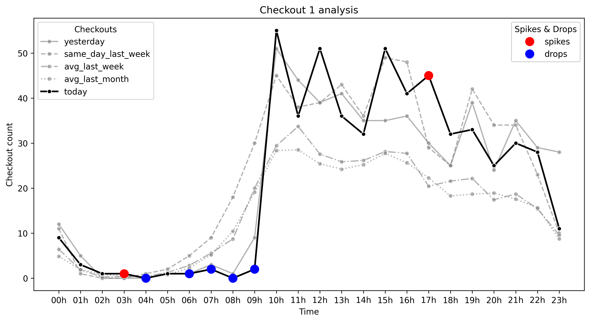
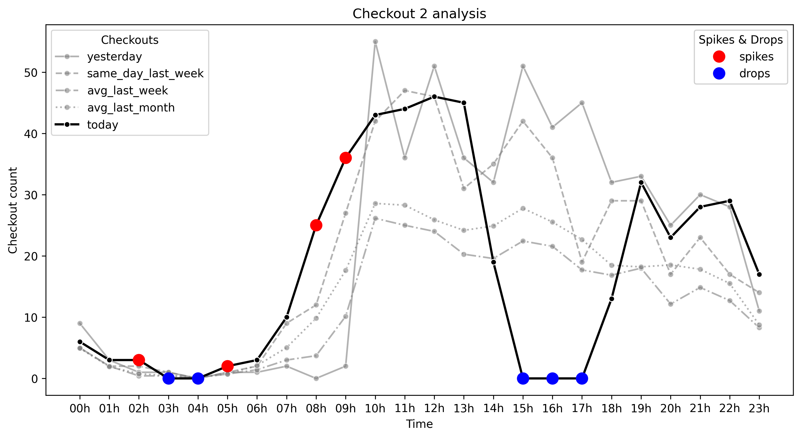

# Lucas Lazzari application for the Monitor Intelligence (Nightshift) position

This document presents the methodology, implementation, and main results obtained during both challenges: the checkout analysis and the transactions alert system. The solutions were designed to demonstrate practical data analysis, anomaly detection, and real-time monitoring in a production-like environment.

The project leverages a modern technology stack, including **Python** for data processing and backend development, **SQL** for efficient data querying and storage, and **FastAPI** for building robust web APIs and dashboards. Visualization is handled with **Plotly** and **Seaborn**. Development was accelerated and enhanced with the assistance of AI-powered tools such as **GitHub Copilot** and **Cursor**, which helped streamline coding, debugging, and documentation.

To run any code contained in this repo, you first need to install the necessary dependencies via 
``` bash
pip install -r requirements.txt
```
from the `MonitorIntelligence` folder. 

# Checkout Behavior Analysis — Methodology and Insights

## 1. Introduction

The notebook located in `checkout_analysis/src/checkout_analysis.ipynb` aims to analyze **checkout behavior over time** and detect potential **anomalies** that may indicate operational issues, user behavior changes, or data collection problems. The approach is **comparative**: actual checkouts on the current day are compared against historical baselines (weekly and monthly averages, as well as yesterday and the same day last week).

The rationale behind this analysis is that anomalies rarely appear in isolation. They become evident when the actual behavior **deviates significantly** from what is historically expected. By incorporating multiple baselines (short-, medium-, and long-term), the notebook is able to distinguish between:

* **Random fluctuations** (noise, single-day variation)
* **Short-term operational issues** (e.g., data collection errors or temporary failures)
* **Behavioral shifts** (systematic changes in user activity patterns)

---

## 2. Data

The code first loads the datasets in `/checkout_analysis/data` named `checkout_1.csv` and `checkout_2.csv`, using pandas. The datasets contain the following columns:

  * time: **Hourly timestamp**
  * today: **Today's checkout count**  
  * yesterday: **Yesterday’s checkout count** (immediate context, helps confirm anomalies).
  * avg_last_week: **Last week average** (shorter horizon, sensitive to recent shifts).
  * avg_last_month: **Last month average** (longer horizon, smoother seasonal effects).
  * same_day_last_week: **Same day last week** (seasonal day-of-week effect).

An in-memory DuckDB database is used. The DataFrame is registered as a table via duckdb.register('df', df) and materialized with the SQL statement:
``` sql
CREATE TABLE checkout AS SELECT * FROM df 
```

The SQL query (that can be found in `checkout_analysis/src/query.sql`) containing: 
``` sql
WITH t AS (
  SELECT
    time,
    (regexp_replace(time,'h',''))::int AS hour,
    today,
    yesterday,
    same_day_last_week,
    avg_last_week,
    avg_last_month
  FROM checkout
)
SELECT
  hour,
  time,
  today,
  yesterday,
  same_day_last_week,
  avg_last_week,
  avg_last_month,

  -- percent differences (rounded)
  ROUND(100.0*(today - yesterday) / NULLIF(yesterday,0), 2) AS pct_vs_yesterday,
  ROUND(100.0*(today - same_day_last_week) / NULLIF(same_day_last_week,0), 2) AS pct_vs_same_day_last_week,
  ROUND(100.0*(today - avg_last_week) / NULLIF(avg_last_week,0), 2) AS pct_vs_avg_last_week,
  ROUND(100.0*(today - avg_last_month) / NULLIF(avg_last_month,0), 2) AS pct_vs_avg_last_month,

  CASE
    -- spike conditions
    WHEN today >= 2 * avg_last_week AND today >= 2 * avg_last_month THEN 'spike'
    -- drop conditions
    WHEN today <= 0.5 * avg_last_week AND today <= 0.5 * avg_last_month THEN 'drop'
    ELSE 'ok'
  END AS anomaly_flag


FROM t
ORDER BY hour;
```
is executed in the DuckDB database, allowing for the retrieval of a pandas dataframe with the aditional columns for percent differences and the identification of potential anomalies in the form of spikes and drops. 

This data is loaded into a dataframe, and visualized with seaborn, generating the graphs in `checkout_analysis/graphs`, that can be checked below:
  

The graphs present the available data in line plots with the addition of markers to identify spikes and drops identified via the SQL query.

This structure allows us to check whether today’s values are **significantly above or below expected levels**.

---

## 3. Anomaly Detection Rationale

The notebook does not rely on a single statistical threshold. Instead, it applies **contextual anomaly detection**:

* **Step 1: Compare actual counts vs weekly/monthly averages.**

  * If today’s value is **> 100% higher** or **< 50% lower**, it is flagged as a potential anomaly.

* **Step 2: Validate with yesterday and the same day last week.**

  * If the deviation is also present yesterday or last week, it may not be an anomaly but rather a **behavioral shift**.
  * If the deviation is unique to today (but not seen historically), it strengthens the anomaly hypothesis.

* **Step 3: Categorize anomalies.**

  * **Critical anomaly:** Large deviation with no historical precedent.
  * **Moderate anomaly:** Noticeable deviation, but partially aligned with history.
  * **Seasonal / baseline shift:** Consistent with recent days → not an anomaly, but a change in trend.

This layered approach prevents false alarms while still capturing unusual events.

---

## 4. Analysis Sections

Below are the detailed written analyses directly for each dataset. They are also presented in the notebook.


### Analysis 1

Early Morning (00h – 05h)

* Checkout behavior remained **consistent and stable**. The marks on the graph will be discussed below.
* In the graph, the single checkout at 03h is pointed out as a spike, but this is a consequence of both last week and month averages being too low at these times (< 1). It probably isn't an anomaly.
* At 04h, no checkouts were registered, which is expected given the low averages (< 1) at this time.

Morning drop (06h - 09h) - **anomaly candidate**

* Checkouts considerably smaller than what was expected. Specially, at 08h when no checkouts were registered.
* **06h anomaly**:

  * Today: **1 checkout**
  * Expected: 2-3 checkouts (last week/month avgs)
* **07h anomaly**:

  * Today: **1 checkout**
  * Expected: \~5 checkouts (last week/month avgs)
* **08h anomaly**:

  * Today: **0 checkouts**
  * Weekly avg: **8.7**
  * Monthly avg: **10.4**
  * Yesterday: **1 checkout**
* **09h anomaly**:

  * Today: **2 checkouts**
  * Expected: \~20 (last week/month avgs)
* This suggests a **short-term operational issue** (last 2 days), not a long-term trend, since it did not appear last week but was also reflected yesterday, in particular from 06h to 08h.


Peak Build-up (10h – 11h)

* **10h peak (today)**: **55 checkouts**

  * +86.9% vs weekly avg (29.4)
  * +93.9% vs monthly avg (28.3)
  * +7.8% vs yesterday (51)
  * +13% vs the same day last week (45)
* Normally, peak occurs at **11h (avg 33.7)** → today shifted **1h earlier**.

  * In line with yesterday and the same day last week. May suggest a recent behavioral change.


Afternoon (12h – 17h) - **anomaly candidates**

* Consistently **above both averages** across multiple hours:

  * **12h**: 51 checkouts → +85% vs weekly avg (27.6), +100% vs monthly avg (25.4), +31% vs yesterday and the same day last week (39)
  * **15h**: 51 checkouts → +81% vs weekly avg (28.1), +84% vs monthly avg (27.7), +46% vs yesterday (35), +4% vs the same day last week (49)
  * **17h**: 45 checkouts → +120% vs weekly avg (20.4), +102% vs monthly avg (22.3), +50% vs yesterday (30), +55% vs the same day last week
* The 12h peak is well above both averages, **moderate anomaly**
* The 15h peak is aligned with last week's 49 checkouts on the same day -> likely not an anomaly, but a weekly pattern.
* 17h peak well above any other day, **strong anomaly**.


Evening (18h – 22h)

* Checkouts remained **well above historical averages**, but in line with yesterday and the same day last week.
* May indicate a baseline shift.


**Possible Anomalies**

* **Critical**: 06h – 09h drop; 17h spike.
* **Moderate**: 12h.
* **Seasonal** (likely not an anomaly): 15h.

---

### Analysis 2

Early Morning (00h – 06h)

* Checkout behavior remained **consistent and stable**.
* The 3 checkouts at 02h and the 2 at 05h are flagged as spikes, but these likely reflect **low historical baselines** (< 1 checkout) rather than real anomalies.
* At 03h and 04h, no checkouts occurred — which is expected given the historically low averages.


Morning Spikes (07h – 09h) — **Anomaly Candidates**

* Checkouts show a **clear deviation** from expectations.

**07h — Moderate Anomaly**

* Today: **10 checkouts**
* Expected: 3–5 checkouts (weekly/monthly averages)
* Yesterday: 2 checkouts (possibly anomalous baseline)

**08h — Strong Anomaly**

* Today: **25 checkouts**
* Weekly avg: **3.71 checkouts** (+573%)
* Monthly avg: **9.82 checkouts** (+155%)
* Same day last week: **12 checkouts** (+108%)
* Yesterday: **0 checkouts** (anomalous)

**09h — Strong Anomaly**

* Today: **36 checkouts**
* Expected: **10–17 checkouts** (weekly/monthly averages) → > +100% deviation
* Same day last week: **27 checkouts** (+33%)
* Yesterday: **2 checkouts** (anomalous)

Midday Peak (10h – 13h)

* Checkout levels remained **well above weekly/monthly averages**,
* but aligned with yesterday and the same day last week.
* Suggests a **baseline shift** rather than a temporary anomaly.


Afternoon (14h – 18h) — **Anomaly Candidates**

* **14h:** 19 checkouts

  * Slightly below averages (19.5–24.9)
  * Considerably lower than yesterday (32) and last week (35).

* **15h – 17h:** **No checkouts registered → Strong anomaly candidate.**

* **18h:** 13 checkouts, indicating **possible reestablishment of data collection**.


Evening (19h – 23h)

* Checkouts stayed **above historical averages**,
* but consistent with yesterday and the same day last week.
* Likely reflects a **baseline shift**.

**Possible Anomalies**

* **Critical:**

  * 08h–09h spikes
  * 15h–17h drop

* **Moderate:**

  * 07h
  * 14h (beginning of afternoon drop)
  * 18h (recovery after missing data)

---

## 5. Conclusion

The methodology combines **quantitative thresholds** with **contextual validation**, ensuring anomalies are detected in a robust manner. The analyses reveal both **short-term operational issues** (e.g., missing data or sudden drops) and **longer-term behavioral shifts** (consistent increases aligned with yesterday and last week).

This structured approach enables stakeholders to distinguish between:

* **True anomalies** requiring immediate action, and
* **Baseline shifts** signaling evolving user behavior.

---


# Transactions Alert System

## 1. Introduction

The Transactions Alert System is an automated platform designed to monitor transaction data, detect anomalies in real time using statistical and machine learning models, and notify users of unusual patterns or potential issues via email alerts. It also contains a web dashboard and allows the user to query the database via API endpoints.

---

## 2. Data

The datasets used in this challenge are located in the `transactions_alert_system/data` directory, specifically in the files **`transactions_1.csv`** and **`transactions_2.csv`**. Each dataset contains the following columns:

* **count** (or **f0\_**): Number of transactions recorded in the given time interval.
* **status**: Transaction status, which can take the values *approved*, *denied*, *reversed*, *backend\_reversed*, *failed*, or *processing*.
* **time**: Transaction timestamp in the format `"HHh MM"`.

For this analysis, **`transactions_1.csv`** was selected as the **baseline dataset**, both for the statistical modeling approach (z-score) and for training the machine learning model (**IsolationForest**).


## 3. Anomaly detection 

The anomaly detection in this project employs a hybrid approach, combining both robust statistical modeling and machine learning to identify unusual transaction patterns. The methodology is as follows:

- **Statistical Baseline Modeling:**
  - For each hour and transaction status, the system computes baseline statistics (mean, standard deviation, median absolute deviation, 95th and 99th percentiles) from historical data.
  - Z-scores are calculated for each new transaction group, allowing the system to flag values that deviate significantly from historical norms.
  - The use of the Median Absolute Deviation (MAD) provides robustness against outliers and non-Gaussian data.

- **Isolation Forest Machine Learning:**
  - An Isolation Forest model is trained on engineered features (such as total transaction count, bad transaction count, bad rate, and their rolling deltas) to detect multivariate anomalies.
  - This model is retrained whenever the baseline is updated, ensuring it adapts to new patterns in the data.
  - The model is only used if sufficient baseline data is available; otherwise, the system falls back to pure statistical analysis.

- **Combined Decision Logic:**
  - An anomaly is flagged as **critical** if both the statistical and machine learning models agree (e.g., z-score > 3 and Isolation Forest predicts anomaly).
  - **Warning** anomalies are flagged if only one model indicates a significant deviation.
  - This layered approach reduces false positives and increases the reliability of alerts.

---

## 4. API Endpoints

To run the application from the `MonitorIntelligence` folder, use the following command:

```bash
uvicorn transactions_alert_system.src.app:app --reload
```

This will expose the following endpoints:

* **`POST /transactions`** — Accepts a batch of transactions, stores them in the database, runs anomaly detection, and triggers notifications if any anomalies are detected.
* **`POST /query`** — Allows querying transactions by hour and/or status.
* **`GET /dashboard`** — Provides a real-time HTML dashboard with visualizations of transaction volumes, status breakdowns, and detected anomalies for the most recent hour.
* **`GET /`** — Returns a welcome message and points users to the API documentation.

**Notes:**

* The **GET endpoints** can be accessed directly from a web browser once the app is running.
* The **POST endpoints** can be tested using `curl` in the terminal, or via the interactive Swagger UI available at [http://127.0.0.1:8000/docs/](http://127.0.0.1:8000/docs/), which allows friendly data submission and inspection of system responses.

---

## 5. Notification System

The notification system is designed to alert stakeholders via email when anomalies are detected:

- **Grouping:** Anomalies are grouped by severity (critical, warning) and summarized in a single email.
- **Email Delivery:** Uses SMTP (e.g., Gmail) to send alerts to a configurable list of recipients.
- **Configuration:**
  - Email credentials and recipient addresses are set via environment variables, which can be provided in a `.env` file or exported in the terminal before running the application.
  - Required variables include `SMTP_USER`, `SMTP_PASS`, and `ALERT_RECIPIENTS`.

The email will be in the following format:

```
Transaction Anomaly Alert
Generated at: 2025-08-24 18:24:23

Critical Anomalies: 1

  - Time: 16h 30
  - Status: TransactionStatus.DENIED
  - Count: 1000
  - Score: 26.26
  - Reason: CRITICAL: Count (1000) exceeds 99th percentile (109.30) and z-score (26.26) > 3, isolation forest: anomaly
```

**To receive email notifications, ensure you have set the following environment variables:**

```
SMTP_USER=your-email@gmail.com
SMTP_PASS=your-app-password
ALERT_RECIPIENTS=recipient1@example.com,recipient2@example.com
```

You can set these in a `.env` file in the project root, or export them in your terminal session:

```
export SMTP_USER=your-email@gmail.com
export SMTP_PASS=your-app-password
export ALERT_RECIPIENTS=recipient1@example.com,recipient2@example.com
```

The notification system will only send emails if these variables are properly configured.

---

## 6. Possible improvements

While the Transactions Alert System is functional and effective, several improvements could further enhance its robustness, maintainability, and scalability:

- **Robust Testing:**
  - Implement comprehensive unit and integration tests for all core modules, including the anomaly detection logic, API endpoints, and notification system.
  - Add automated test suites to validate edge cases, error handling, and performance under high load.
  - Use test data with known anomalies to ensure detection accuracy and minimize false positives/negatives.

- **Advanced Logging and Monitoring:**
  - Integrate structured logging throughout the codebase to capture key events, errors, and system metrics.
  - Add real-time monitoring and alerting for system health, API errors, and notification delivery failures.
  - Store logs in a centralized location (e.g., ELK stack, cloud logging service) for easier troubleshooting and auditing.

- **Configuration and Security:**
  - Use a configuration management system or environment variable validation to prevent misconfiguration.
  - Secure sensitive credentials (SMTP, database) using secrets management tools or encrypted storage.

- **Scalability and Performance:**
  - Optimize database queries and consider asynchronous processing for high-throughput scenarios.
  - Add support for batch anomaly detection and parallel processing of large transaction datasets.

- **User Experience and Extensibility:**
  - Enhance the dashboard with more interactive visualizations, historical anomaly trends, and filtering options.
  - Provide more granular notification controls (e.g., per-status, per-threshold, or per-recipient).
  - Document the API and system architecture for easier onboarding and maintenance.

- **Model Improvements:**
  - Experiment with additional anomaly detection algorithms (e.g., autoencoders, time series models) for improved accuracy.
  - Incorporate feedback loops to learn from false positives/negatives and adapt thresholds over time.

Implementing these improvements would make the system more reliable, easier to maintain, and better suited for production environments.

---

## 7. Conclusions

The Transactions Alert System provides a robust and automated solution for monitoring transactional data and detecting anomalies in real time. By combining statistical baselines with machine learning models, the system is able to identify both subtle and significant deviations from expected behavior, reducing false positives and increasing the reliability of alerts. The integration of a web dashboard and an automated email notification system ensures that stakeholders are promptly informed of potential issues, enabling faster response and resolution. The modular API design allows for easy integration with other systems and supports flexible querying and visualization. Overall, this platform enhances operational awareness, supports data-driven decision-making, and helps maintain the integrity and reliability of transaction processing environments.